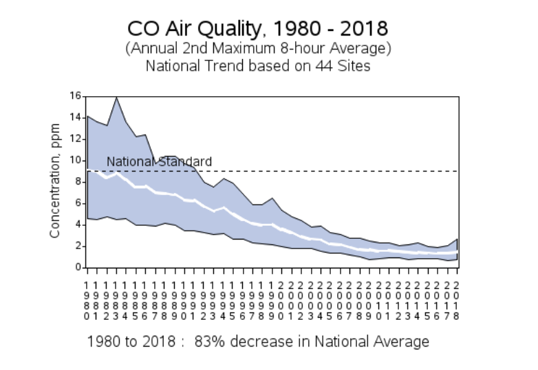
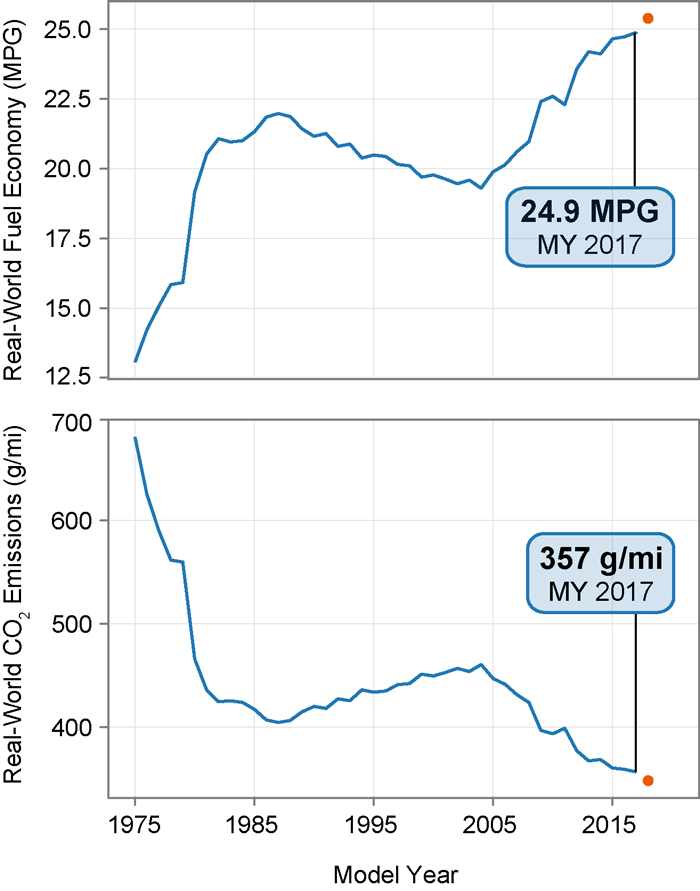

# **Fuel Economy and Its Impact on the Environment**

#### Project Code Name:
NOGAS

#### Team Member Names:
Ye Ju Kim, David Xu, Kevin Zhao, Talin Hans

### Introduction

* **Problem situation**: While rapid industrialization has improved our standard of living significantly, the pollution it produces has detrimental effects on societies and ecosystems on a global scale. Additionally, because of the widespread implementation of newfound technology, such as the invention of cars, almost every person on this planet not only contributes but is affected by this issue on a daily basis. Despite the complications, this brings to our progression as a civilization, many remain conflicted when weighing the convenience of such industrialization with the dangerous long-term effects it leaves. Even with its unethical reasoning, society holds fast onto harmful technology that could potentially cause harm to the environment, and thus damaging living conditions on Earth as a whole.

 * **What is the problem?**  For the current time, while society as a whole transition from gas combustion engines to hybrid and pure electric vehicles like those produced by Tesla, and the primary bulk of vehicles on the road being of combustion engines, fuel economy remains an important figure. Vehicles that depend on combustion engines to create power emit carbon monoxide and various other particulates into the air. Ultimately, this creates long-term effects on the environment and living conditions on Earth.

 * **Why does it matter?**  Environmental change is one that has been overlooked for many generations but has become a key one for ours and has become an existential threat. If we are to continue down the same polluting manner, the consequences will be devastating: it is estimated that a 2 Celsius increase could mean “more heatwaves, a ten-fold increase in Arctic ice-free summers and a complete wipe-out of the world's coral reefs, home to millions of species” bringing a myriad of ramifications to all inhabitants of Earth (UN Environment Program). As the ecosystem is in a cycle, polluting it will inevitably lead to worsened living conditions for ourselves, such as causing acid rain, Additionally, as humans are not an interplanetary species at the moment (go Elon Musk!), if Earth becomes uninhabitable it will lead to the demise of us all.
 * **How will it be addressed?** : We understand that change cannot happen overnight. From the early era of steam engines to the current combustion engines and to the futuristic all-electric power sources, innovation takes time. However, we hope that by displaying trends and data, we can coerce people to speed up this transition to greener energies and ultimately a greener economy.

### Research Questions:
* How has a fuel efficiency of automotive in the U.S. changed over time?

* Are there any correlations between the trends of fuel efficiency and the trends of emissions?

### Possible Data Sets:
* Automotive trends report from EPA. This dataset contains data on every new light-duty vehicle model sold in the United States since 1975. This dataset presents current and historic data that provides a comprehensive overview of the automotive industry here in the U.S. It also contains data of CO emissions. link: https://www.epa.gov/automotive-trends/download-data-automotive-trends-report. There are 44 observations, one observation for each year. There are 8 attributes, which are attributes of the new cars in that year.

* National air quality trends report from EPA. This dataset shows the national trends for distinguishing pollutant emission contributions among major source types on a national level.  The trends shown are for criteria air pollutants (CAPs) and precursors covered by the National Ambient Air Quality Standards (NAAQS).  link: https://www.epa.gov/air-emissions-inventories/air-pollutant-emissions-trends-data. There are 7 datasheets, one for each CAPs, which includes CO, NOx, PM2.5, etc. There are 13 observations for each datasheet, which are the sources of pollutants, including highway and off-highway vehicles. There are 33 attributes, which are the years the data attribute to.

### Info Visualizations
Figure 1: This graphic shows the national trends in carbon monoxide levels in the air. In our project, we would like to analyze the trends between fuel efficiency and air quality. (Source: The United States Environmental Protection Agency)

Figure 2: This graphic shows the estimated Carbon Dioxide(CO2) emissions for new vehicles and comparing it to the fuel economy since 1975. In our project, we would like to delve into how fuel efficiency and economy have changed over time. (Source: The United States Environmental Protection Agency)

### Team work commitments
* Weekly meeting times: Weekdays after 7:30 pm
* Individual Goals:
  * **Ye Ju Kim**: **Role:** Team Manager/Tech Lead: Making sure everyone is on the same page and finishing their individual work before deadlines.
  **Goal:** Learn more about environmental changes due to industrialization from the research we do, communicate well with my team members!
  * **David Xu**: **Role:** Maintain the GitHub repository and the corresponding files, ensure project deadlines are met and all components are completed.
  **Goal:** Delve into our topic of research and analyze the data to see the underlying trends, ensure all components of the project are presented appropriately.
  * **Kevin Zhao**: **Role:** Research data trends and helping to create visualizations of the data and numeric calculations.
  **Goal:** Discovering correlations and presenting our findings using the techniques we learned in class.
  * **Talin Hans**: **Role:** Developer. Work with the data set to manipulate it and handle it. **Goal:** To create a project that makes a difference. Also to make the best possible project possible while working and having fun with my teammates.

### References
* [1] CO Air Quality, 1980 - 2018. United States Environmental Protection Agency. Retrieved from: https://www.epa.gov/air-trends/carbon-monoxide-trends
* [2] Highlights of the Automotive Trends Report. United States Environmental Protection Agency. Retrieved from: https://www.epa.gov/automotive-trends/highlights-automotive-trends-report
* [3] “Why Does Climate Change Matter?”. United Nation Environment Programme. Retrieved from: https://www.unenvironment.org/explore-topics/climate-change/why-does-climate-change-matter
